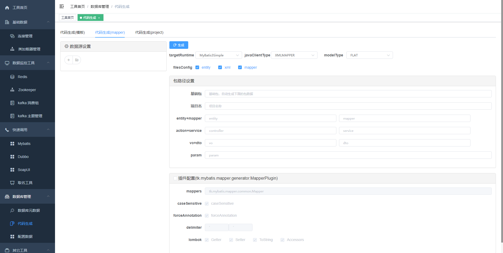

## 代码生成

### 界面美图




### 功能说明

- 第一个标签页是使用模板方案生成
- 第二个标签页是生成 orm 代码，使用 mybatis-generator ， 可配置插件 tkmybatis 
- 第三个是直接生成项目代码（延后实现)

### 模板/方案说明

* 上传的模板文件名命名格式为  名称.后缀.模板类型， 上传到后台后，会自动在中间加入上传时间戳
* 编辑方案和新加方案是一起的，填写的方案名存在就是修改，否则新加方案，方案可以包含很多模板，最终是按方案来生成代码
* 【单文件复选按扭】表示数据源中的表直接提供给模板引擎，而不是循环一个个提供，这个最终决定生成一个文件，还是按表数量生成多个文件
* 暂时只支持 freemarker 模板，请以 ftl 结尾你的模板名称

### 模板可用字段

相关使用的类，请直接看源码中的字段说明

**单文件可用字段**

```
tables : List<TableMetaData>
```

**多文件可用字段**

```
table: TableMetaData
mapping : JavaBeanInfo
package : CodeGeneratorConfig.PackageConfig
```

### 模板示例

1. 表名导出

   ```
   <#list tables as table>
       -- ${table.table.remark!}
       ${table.actualTableName.schema}.${table.actualTableName.tableName}
   </#list>
   ```

   

### mybatis-generator 

第二个标签页是使用 mybatis-generator 来生成代码的可视化操作，并且可以添加 tkmybatis 的插件，比自己去配置还是方便点

